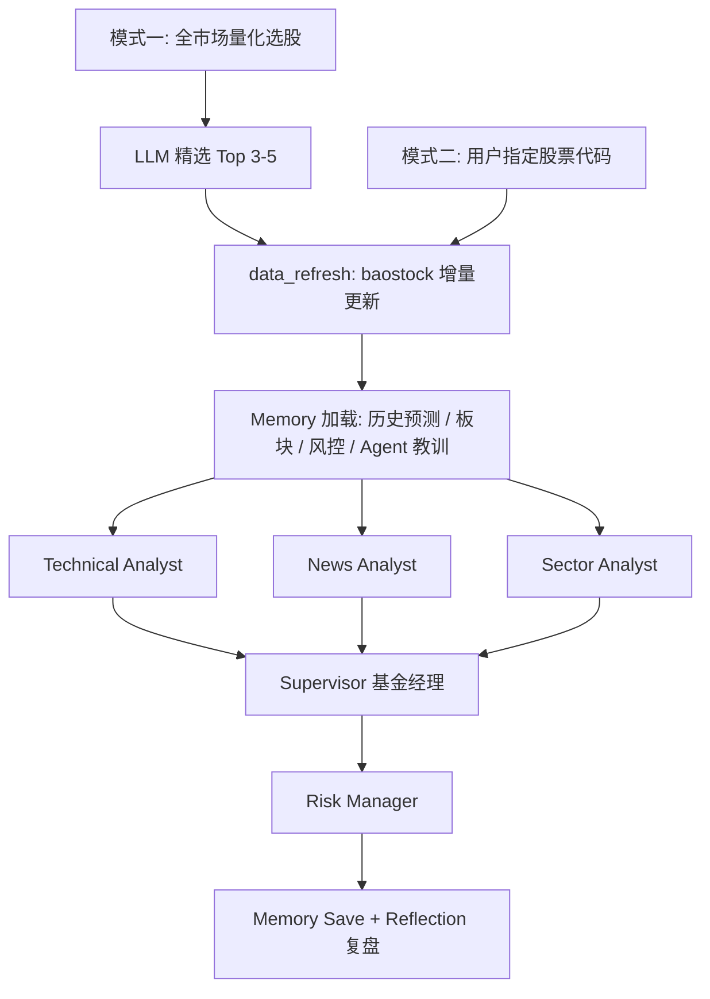

# Stock Research Multi-Agent System

[](https://github.com/Box0528/stock-multi-agent-system/actions/workflows/test.yml)

基于 LangGraph 的 A 股多智能体投研系统。量化模型负责选股，6 个专职 Agent 并行完成技术、新闻、板块分析并输出研究报告。

## 架构



## 两种模式

**模式一 — 主动扫描**：量化模型筛全市场候选池 → LLM 精选 Top 5 → 多智能体并行深度分析 → 输出今日投研排名。

**模式二 — 指定分析**：输入股票代码 → 完整多智能体分析 → 输出研究报告。

## 特性

- **多智能体并行**：6 个专职 Agent（技术 / 新闻 / 板块 / 基金经理 / 风控 / 复盘）并发执行，LangGraph StateGraph 管理状态流转与错误恢复
- **自主搜索规划**：News Analyst 自行生成搜索关键词组合，按时间维度分层检索，附严格时效约束（7 天 / 30 天分级降级）
- **Tool Receipts 幻觉检测**：每次工具调用的原始返回被保留为收据，报告生成后确定性程序比对数字声明是否有据可查，不引入第二个 LLM（[arXiv:2603.10060](https://arxiv.org/pdf/2603.10060)）
- **四层向量记忆**（ChromaDB）：预测追踪 / 板块轮动 / 风控历史 / Agent 教训，按真实交易日归档
- **Reflection 闭环**：复盘引擎对比历史预测与实际走势，归因到具体 Agent，教训自动注入下次分析
- **可观测性**：结构化 EventBus + SSE 实时推送每步执行状态；线程安全 CostTracker 追踪 Token 与工具消耗
- **数据自包含**：baostock 下载脚本收编进仓库，分析前自动检测新鲜度并增量更新，实时价格 akshare → 本地 CSV 主备降级
- **147 个自动化测试**，零真实 API 消耗，GitHub Actions CI，Docker 一键部署

## 快速启动

```bash
# 1. 安装依赖
pip install -r requirements-lock.txt

# 2. 配置环境变量
cp .env.example .env
# 必填：DEEPSEEK_API_KEY、TAVILY_API_KEY
# 可选：ACCESS_KEY（公网部署建议设置）、CORS_ORIGINS

# 3. 下载股票数据
python scripts/scheduled_refresh.py

# 4. 启动服务
uvicorn api.server:app --host 0.0.0.0 --port 8000

# 浏览器打开 http://localhost:8000
```

```bash
# 或用 Docker
docker compose up --build
```

## 目录结构

```
├── agents/                   # 6 个 Agent 实现
│   ├── technical_analyst.py
│   ├── news_analyst.py
│   ├── sector_analyst.py
│   ├── supervisor.py
│   ├── risk_manager.py
│   └── reflection.py
├── core/                     # 基础设施
│   ├── event_bus.py
│   ├── cost_tracker.py
│   ├── cognitive.py          # 推理链 / 自评估 / AgentOutput
│   ├── grounding.py          # Tool Receipts 溯源校验
│   ├── resilience.py
│   └── cache.py
├── graph/
│   ├── workflow.py           # 模式二工作流
│   └── scan_workflow.py      # 模式一扫描工作流
├── memory/
│   ├── vector_store.py
│   └── extraction.py
├── tools/
│   ├── stock_data.py
│   ├── search.py
│   ├── price_api.py
│   └── data_pipeline.py
├── data_downloader.py        # baostock 下载脚本（收编进仓库）
├── api/server.py             # FastAPI + SSE + 鉴权 / 限流
├── frontend/
│   ├── index.html
│   ├── css/main.css
│   └── js/
├── config.py
├── Dockerfile / docker-compose.yml
├── .github/workflows/test.yml
└── tests/                    # 147 个自动化测试
    ├── test_agents/          # 6 个 Agent 的 prompt 构建 + 输出处理（假 LLM）
    ├── test_memory/          # 报告字段提取（纯函数）
    ├── test_core/            # EventBus / CostTracker / Tool Receipts / Resilience
    ├── test_api/             # FastAPI 接口 + 鉴权（TestClient）
    └── test_tools/
```

## 技术栈

| 组件 | 技术 |
|------|------|
| Agent 编排 | LangGraph 1.2+ (StateGraph) |
| LLM | DeepSeek (deepseek-chat) via langchain-openai |
| 向量记忆 | ChromaDB + sentence-transformers |
| 后端 | FastAPI + SSE + slowapi |
| 数据源 | baostock / akshare / Tavily |
| 前端 | 原生 HTML/CSS/JS（模块化）+ lightweight-charts |
| 测试 / CI | pytest + GitHub Actions |
| 部署 | Docker + docker-compose |

## Roadmap

- [x] 双模式投研闭环（主动扫描 + 指定分析）
- [x] 四层 Memory + Reflection 复盘引擎
- [x] Tool Receipts 幻觉检测（Technical Analyst 试点）
- [x] 分层测试体系 + CI / Docker 部署
- [ ] Tool Receipts 覆盖全部分析师 Agent
- [ ] 以溯源分校准置信度，替代 LLM 自评
- [ ] Supervisor 协商机制：信号矛盾时向分析师追问

## Contact

kazusa951634713@outlook.com
