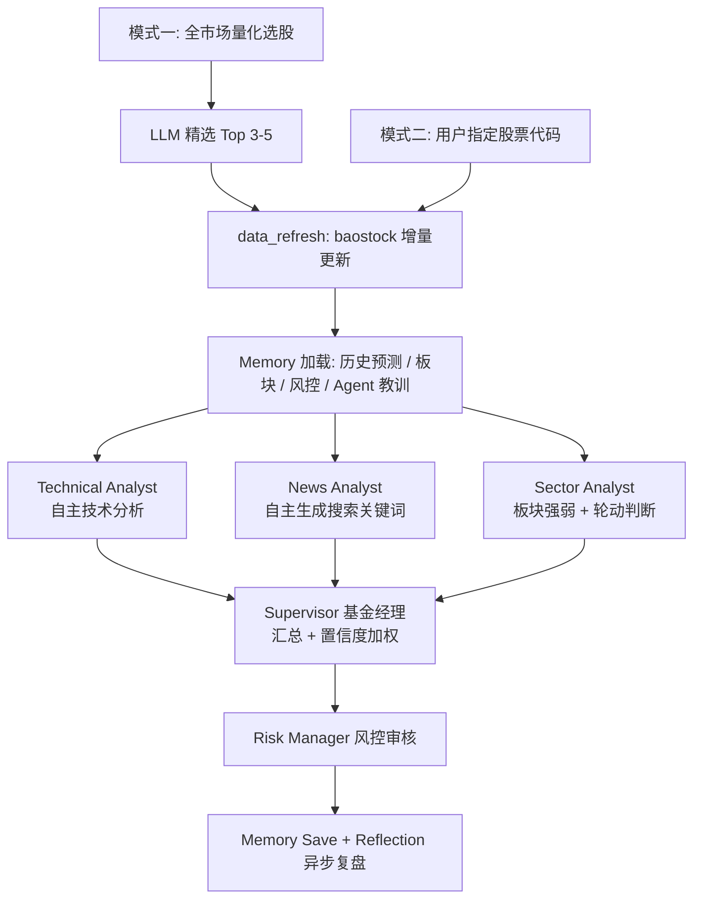

# 股票研究 Multi-Agent 智能投研系统

[](https://github.com/Box0528/stock-multi-agent-system/actions/workflows/test.yml)

基于 LangGraph 编排的多智能体协作投研系统，模拟基金公司的投研团队工作模式。

## 项目动机

平时做股票投研，大量时间花在"找股票"和"重复看盘"上——量化模型筛出候选池之后，还要逐个看技术面、查新闻、判断板块强弱、评估风险，这套流程几乎每次都要手动跑一遍。这个项目想做的是：把这些重复性的分析步骤交给一组各司其职的 AI Agent 去做，量化模型负责"在哪儿找"，Agent 负责"深入看"，自己只需要复核关键判断，省下大量盯盘和整理资料的时间。

## 关于开发方式

本项目采用 AI 辅助编程（vibe coding）开发——需求设计、架构决策、技术方案取舍和测试验证由我主导，具体代码实现由 AI（Claude Code）协作完成。项目里的关键技术选型都经过权衡判断，例如：为什么用 LangGraph 而不是简单的工具调用循环、为什么测试要用假 LLM 而不是真实 API 调用、幻觉检测要不要引入第二个 LLM 做裁判（结论是不要，详见下方"幻觉检测"一节）——这些都不是放手让 AI 自由发挥的结果。

## 系统架构



## 两种工作模式

**模式一 — 主动研究（项目核心）**：系统自主扫描全市场，量化选股筛出候选池，LLM 精选 Top 3-5 只，然后对每只股票执行完整多智能体深度分析，输出今日投研排名报告。

**模式二 — 指定分析**：用户输入股票代码，系统对该股票执行完整的多智能体分析，输出研究报告。

两种模式形成"发现机会 → 深度研究"的完整投研闭环。

## 技术亮点

### 工程架构
- **LangGraph StateGraph** 编排 6 个 Agent 节点，显式状态流转
- **ThreadPoolExecutor 真并行**：3 个分析师并发执行，耗时取最慢的一个（非串行累加）
- **结构化事件总线**（EventBus）替代 monkey-patch print，每个请求独立实例，解决并发竞态
- **SSE 流式推送**：实时展示每个 Agent 的执行状态、工具调用、推理过程
- **成本追踪器**（CostTracker）：线程安全，统计 LLM 调用/Token/搜索/工具消耗

### 自主 Agent 设计
- **News Analyst 自主规划搜索策略**：不依赖外部任务规划，自行组合 2-4 个关键词，先搜今日动态再搜近7天背景
- **Sector Analyst 强制行业精确匹配**：内置防幻觉约束，调用工具时必须使用系统传入的精确行业名称，禁止 LLM 自行改写
- **时间约束强执行**：新闻分析基于当天日期计算，7天内正常引用，超7天强制标注"历史参考"，超30天直接降级不入报告

### 幻觉检测（进行中）
- **Tool Receipts 机制**：Agent 调用工具时的原始返回结果会被保留为"收据"，报告生成后用**确定性程序比对**（不是另一个 LLM 做语义判断）核对报告里的数字声明能否在收据里找到依据
- 之所以不用"LLM 裁判 LLM"的方案，是因为裁判模型一样可能产生幻觉，那只是把问题转移了一层，没有解决——这个判断参考了实际论文方法（[Tool Receipts, arXiv:2603.10060](https://arxiv.org/pdf/2603.10060)），不是凭空设计
- 目前只在 Technical Analyst 一个 agent 上做了试点（详见 Roadmap）

### 数据与记忆
- **自包含数据管道**：baostock 下载脚本已收编进仓库（非外部依赖），分析前自动检测数据新鲜度并增量更新
- **四层 Memory**（ChromaDB）：预测追踪 / 板块轮动 / 风控历史 / Agent 行为教训
- **记忆按真实交易日归档**：而非系统运行时刻，避免行情数据滞后时记忆归属错位
- **Reflection 复盘引擎**：对比历史预测与实际走势，评估准确率，归因到具体 Agent
- **Agent 行为教训闭环**：复盘产生的教训自动注入下次分析的 Agent prompt（有效性验证见 Roadmap）

### 部署与安全
- **共享密钥鉴权**：前端访问码弹窗 + 后端 `X-API-Key` 校验，未配置时不影响本地开发
- **接口限流**（slowapi）：按 IP 限制高成本端点调用频率，防止额度被刷爆
- **CORS 环境变量化**：部署时无需改代码，配置一行环境变量即可
- **容器化**：Dockerfile + docker-compose.yml（数据/向量库目录用 volume 持久化）
- **依赖版本锁定**：`requirements-lock.txt` 保证构建可复现

### 质量保证
- **141 个自动化测试**，分层覆盖：纯函数解析逻辑 → 假 LLM 的 Agent prompt/输出处理逻辑（零真实 API 消耗）→ FastAPI 接口集成测试
- **GitHub Actions CI**：push/PR 自动跑全量测试
- **LLM 重试**（指数退避）+ 工具调用降级
- **Pydantic Settings** 集中配置，消除魔法数字
- **搜索缓存**：同一查询当天只调一次 Tavily API
- **价格数据主备降级**：akshare → 本地 CSV 兜底

## 技术栈

| 组件 | 技术 |
|------|------|
| Agent 编排 | LangGraph 1.2+ (StateGraph) |
| LLM | DeepSeek (deepseek-chat) via langchain-openai |
| 向量记忆 | ChromaDB + sentence-transformers |
| 后端 | FastAPI + SSE + slowapi |
| 数据源 | baostock（A股日线，已收编进仓库）+ Tavily（新闻搜索）+ akshare（实时价格） |
| 前端 | 原生 HTML/CSS/JS（模块化拆分）+ lightweight-charts |
| 测试 | pytest |
| CI/部署 | GitHub Actions + Docker |

## 快速启动

```bash
# 1. 安装依赖（项目以 sys.path 方式运行，不是 pip 安装包，直接装依赖即可）
pip install -r requirements-lock.txt

# 2. 配置 .env
cp .env.example .env
# 必填：DEEPSEEK_API_KEY、TAVILY_API_KEY
# 可选：ACCESS_KEY（部署到公网前建议设置）、CORS_ORIGINS

# 3. 下载股票数据
python scripts/scheduled_refresh.py

# 4. 启动服务
uvicorn api.server:app --host 0.0.0.0 --port 8000

# 5. 访问
# 浏览器打开 http://localhost:8000
```

### 用 Docker 启动

```bash
docker compose up --build
```

> Dockerfile/docker-compose.yml 已提供（数据目录用 volume 持久化），尚未在生产环境实测验证，本地优先用上面的方式启动。

## 目录结构

```
├── agents/                  # 6 个 Agent 实现
│   ├── technical_analyst.py   # 技术分析（工具：选股/个股指标，已接入 Tool Receipts）
│   ├── news_analyst.py        # 新闻舆情（工具：Tavily 搜索，自主生成关键词）
│   ├── sector_analyst.py      # 板块分析（工具：板块统计/搜索）
│   ├── supervisor.py          # 基金经理（汇总+置信度加权）
│   ├── risk_manager.py        # 风控审核
│   └── reflection.py          # 复盘引擎
├── core/                     # 核心基础设施
│   ├── event_bus.py            # 结构化事件总线
│   ├── cost_tracker.py         # 成本追踪器
│   ├── cognitive.py            # 认知协议（推理链/自评估/AgentOutput）
│   ├── grounding.py            # Tool Receipts 溯源校验（纯函数）
│   ├── resilience.py           # 重试机制
│   └── cache.py                # 搜索缓存
├── graph/                    # LangGraph 工作流
│   ├── workflow.py              # 模式二：指定分析
│   └── scan_workflow.py         # 模式一：主动扫描
├── memory/                   # ChromaDB 向量记忆
│   ├── vector_store.py          # 四层记忆存取（I/O）
│   └── extraction.py            # 报告字段提取（纯函数，独立可测）
├── tools/                     # Agent 工具集
│   ├── stock_data.py            # 量化选股/技术指标/板块统计
│   ├── search.py                # 新闻搜索（带缓存）
│   ├── price_api.py             # 实时价格（主备降级）
│   └── data_pipeline.py         # 数据管道（调度 data_downloader.py）
├── data_downloader.py          # baostock 下载脚本（已收编，未改动核心逻辑）
├── api/server.py                # FastAPI + SSE + 鉴权/限流中间件
├── frontend/                     # 前端（模块化）
│   ├── index.html
│   ├── css/main.css
│   └── js/                        # sse-client / agent-timer / report-render / chart-render / auth / app
├── config.py                     # Pydantic Settings 集中配置
├── Dockerfile / docker-compose.yml
├── .github/workflows/test.yml    # CI
└── tests/                        # 141 个自动化测试
    ├── test_agents/                # 假LLM测试：6个agent的prompt构建+输出处理
    ├── test_memory/                # 纯函数测试：报告字段提取
    ├── test_core/                  # 含 Tool Receipts 溯源校验测试
    ├── test_api/                   # FastAPI 接口集成测试（含鉴权）
    └── test_tools/
```

## 测试

```bash
pytest tests/ -v
```

测试分三层，没有一层依赖真实 LLM/网络调用：
- **纯函数层**（`test_memory/`、`test_core/`）：直接灌各种格式的报告文本/收据数据，断言提取与校验结果
- **Agent层**（`test_agents/`）：monkeypatch 掉 `get_llm`，验证 prompt 拼接内容和输出后处理逻辑，零 API 消耗
- **接口层**（`test_api/`）：`TestClient` 直接打 FastAPI 路由，验证鉴权/限流/参数校验

## Roadmap

- [x] 双模式投研闭环（主动扫描 + 指定分析）
- [x] 四层 Memory + Reflection 复盘引擎
- [x] 部署安全（鉴权 / 限流 / CORS / Docker / CI）
- [x] 分层测试体系（141 个测试）
- [x] data_downloader 收编进仓库，项目自包含
- [x] News Analyst 自主规划搜索策略（移除 Planner 依赖）
- [x] 时间约束强执行（7天/30天分级，基于当日日期计算）
- [ ] Tool Receipts 幻觉检测：目前仅 Technical Analyst 试点，验证有效后扩展到 News / Sector / Risk Manager
- [ ] 用客观溯源分校准（或部分替代）LLM 自评置信度——取决于上一项积累的真实数据
- [ ] 验证 agent_lessons 闭环是否真的影响了 Agent 输出（目前只是文本拼接进 prompt，从未量化验证过）
- [ ] Agent 间真实协作：Supervisor 发现信号矛盾时可以打回某个分析师追问，而不是单向流水线自己拍板

## Contact

kazusa951634713@outlook.com
