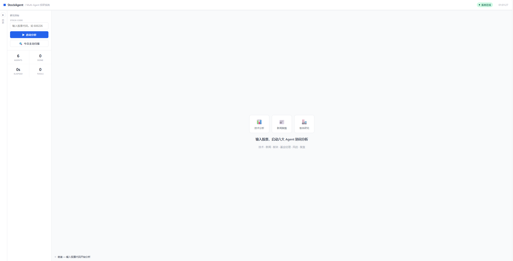
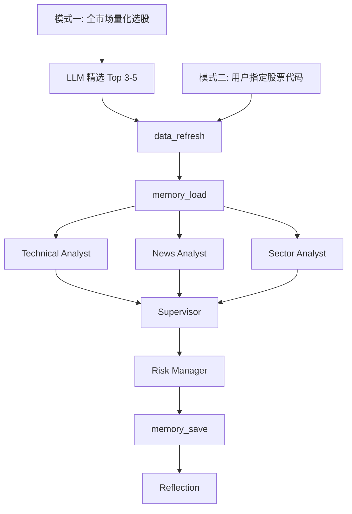

# Stock Research Multi-Agent System

[](https://github.com/Box0528/stock-multi-agent-system/actions/workflows/test.yml)
[](https://www.python.org/)
[](LICENSE)

A 股投研多智能体系统。6 个专职 Agent 通过 LangGraph StateGraph 编排，以 SSE 流式接口向 React 前端推送实时执行状态，支持全市场扫描与单股深度分析两种模式。



---

## 核心特性

- **多 Agent 并行**：Technical / News / Sector 三个分析师通过 `ThreadPoolExecutor` 并发执行，Supervisor 汇总后交 Risk Manager 审核，LangGraph 管理完整状态流转
- **Tool Receipts 幻觉检测**：工具调用原始返回保留为"收据"，报告生成后用确定性程序比对数字声明，不引入第二个 LLM — 参考 [arXiv:2603.10060](https://arxiv.org/pdf/2603.10060)
- **四层向量记忆**：ChromaDB 存储历史预测、板块轮动、风控信号、Agent 行为教训，教训在下次分析时自动注入对应 Agent 的 system prompt
- **Reflection 复盘闭环**：分析结束后独立线程对比实际价格与历史建议（阈值 ±3%），归因写回记忆，形成持续学习链路
- **实时可观测**：EventBus → asyncio.Queue → SSE，每个工具调用、Agent 状态变更实时推送；CostTracker 追踪 Token 与 API 消耗
- **147 个测试用例**，GitHub Actions CI，Docker 多阶段构建一键部署

---

## 快速启动

```bash
# 1. 安装依赖
pip install -r requirements-lock.txt

# 2. 配置环境变量
cp .env.example .env
# 必填：DEEPSEEK_API_KEY、TAVILY_API_KEY
# 可选：ACCESS_KEY（公网部署鉴权）、CORS_ORIGINS

# 3. 下载股票本地数据（baostock，约 5-10 分钟）
python scripts/scheduled_refresh.py

# 4. 启动后端
uvicorn api.server:app --host 0.0.0.0 --port 8000

# 5. 启动前端（另一个终端）
cd frontend-react && npm run dev
```

```bash
# 或用 Docker 一键构建（Node 构建前端 + Python 运行时）
docker compose up --build
# 访问 http://localhost:8000
```

---

## 架构

```
用户输入
  ├─ 模式一（主动扫描）
  │    量化选股 → LLM 精选 3-5 只 → 对每只跑完整 workflow
  └─ 模式二（指定分析）
       股票代码 → 完整 workflow

workflow：
  data_refresh → memory_load
    → [Technical | News | Sector]  ← 并行
    → Supervisor → Risk Manager
    → memory_save → Reflection（独立线程）
```



---

## Agent 职责

| Agent | 工具 | 输出 |
|---|---|---|
| Technical Analyst | `get_stock_detail` / `get_stock_trend` / `get_volume_analysis` | 均线、量价、换手率分析 |
| News Analyst | `search_stock_news` / `search_stock_news_today` | 新闻分级（A/B/C）、舆情结论 |
| Sector Analyst | `analyze_sector` / `search_stock_news` | 板块强度、轮动阶段、资金流向 |
| Supervisor | — | 综合三方报告，输出操作建议与综合评级 |
| Risk Manager | — | 风控审核，仓位建议，信号矛盾标注 |
| Reflection | — | 价格对比归因，行为修正建议写入 Memory |

---

## 技术栈

| 层 | 技术 |
|---|---|
| Agent 编排 | LangGraph 1.2+ (StateGraph) |
| LLM | DeepSeek-V3，via langchain-openai |
| 向量记忆 | ChromaDB + sentence-transformers |
| 后端 | FastAPI + uvicorn，SSE，slowapi 限流 |
| 数据源 | baostock（本地 K 线）/ akshare（实时价格）/ Tavily（新闻搜索）|
| 前端 | React 18 + Vite + lightweight-charts |
| 测试 / CI | pytest 147 用例 + GitHub Actions |
| 部署 | Docker 多阶段构建 + docker-compose |

---

## 目录结构

```
├── agents/                     # 6 个 Agent 实现
├── core/
│   ├── event_bus.py            # EventBus / ConsoleEventBus
│   ├── grounding.py            # Tool Receipts 数字提取与收据比对
│   ├── resilience.py           # retry_llm_call / retry_tool_call
│   ├── review.py               # 模式一复盘数据结构与准确率统计
│   └── cost_tracker.py         # Token / API 调用计数
├── graph/
│   ├── workflow.py             # 模式二 StateGraph
│   └── scan_workflow.py        # 模式一扫描 StateGraph
├── memory/
│   ├── vector_store.py         # ChromaDB 四层读写
│   └── extraction.py           # 报告结构化字段提取（纯函数）
├── tools/                      # baostock / akshare / Tavily 封装
├── frontend-react/             # React 18 + Vite
│   └── src/
│       ├── App.jsx
│       └── components/
│           ├── AgentStage.jsx  # 模式二：Agent 实时状态卡片
│           └── ScanStage.jsx   # 模式一：股票队列视图
├── api/server.py               # FastAPI + SSE + 鉴权
├── Dockerfile
├── docker-compose.yml
└── tests/                      # 147 个测试用例
```

---

## Roadmap

- [x] 双模式投研闭环（主动扫描 + 指定分析）
- [x] Tool Receipts 幻觉检测（三个分析师 Agent 全覆盖）
- [x] 四层向量记忆 + Reflection 复盘引擎
- [x] React 18 前端，SSE 实时进度推送，模式一专属 ScanStage 视图
- [x] 147 用例测试体系 + GitHub Actions CI + Docker 部署
- [ ] Supervisor 协商机制：分析师信号矛盾时主动追问
- [ ] Tool Receipts grounding_score 硬权重校准（当前为 prompt 软约束）
- [ ] 模式一深度分析并行化（当前为串行，受 API 速率限制）

---

## Contributing

欢迎提交 Issue 或 Pull Request。如有功能建议或 bug 反馈，请在 Issues 中描述复现步骤与预期行为。

---

## License

MIT © [Box0528](https://github.com/Box0528)
