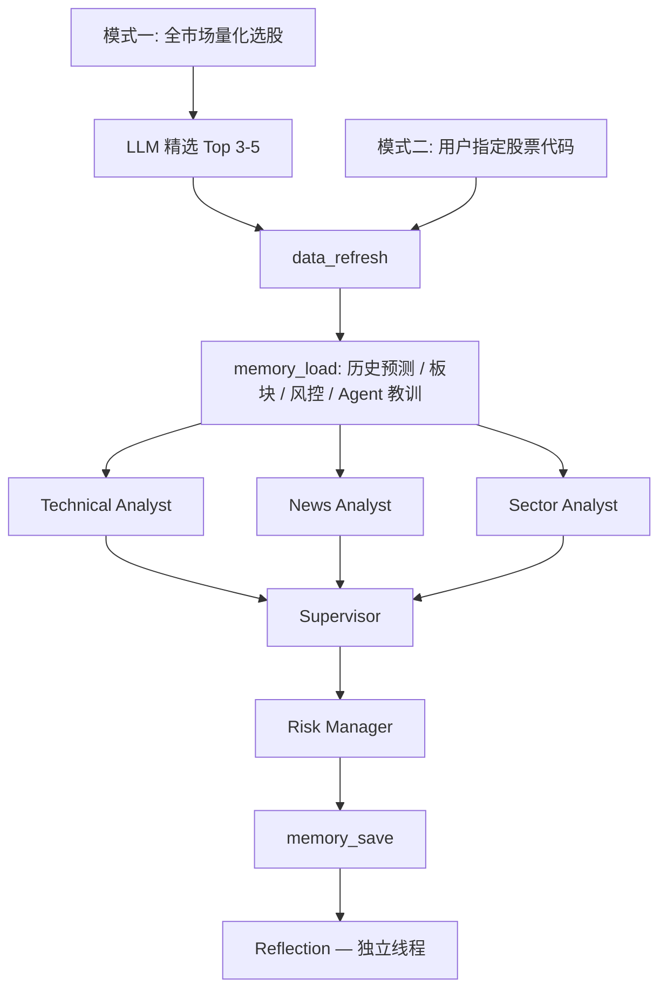

# Stock Research Multi-Agent System

[](https://github.com/Box0528/stock-multi-agent-system/actions/workflows/test.yml)

A 股投研多智能体系统。6 个专职 Agent 通过 LangGraph StateGraph 编排，以 SSE 流式接口向 React 前端推送实时执行状态。

---

## 系统架构

```
用户输入
  │
  ├─ 模式一（主动扫描）
  │    量化选股 → LLM 精选 3-5 只 → 对每只跑完整 workflow
  │
  └─ 模式二（指定分析）
       股票代码 → 完整 workflow
  
workflow：
  data_refresh → memory_load
    → [Technical | News | Sector]（ThreadPoolExecutor 并行）
    → Supervisor → Risk Manager
    → memory_save → Reflection（独立线程，异步复盘）

全程通过 EventBus → asyncio.Queue → SSE 推送到前端
```



---

## Agent 职责

| Agent | 工具 | 输出 |
|---|---|---|
| Technical Analyst | `get_stock_detail` / `get_stock_trend` / `get_volume_analysis` | 均线、量价、换手率分析报告 |
| News Analyst | `search_stock_news` / `search_stock_news_today` (Tavily) | 新闻分级（A/B/C）、舆情结论 |
| Sector Analyst | `analyze_sector` / `search_stock_news` | 板块强度、轮动阶段、资金流向 |
| Supervisor | — | 综合三方报告，输出操作建议和评级 |
| Risk Manager | — | 风控审核，仓位建议，信号矛盾标注 |
| Reflection | — | 对比历史预测与实际价格，归因，修正建议注入 Memory |

---

## 核心机制

### Tool Receipts（幻觉检测）

每次工具调用的原始返回被保留为"收据"（receipt）。报告生成后，`core/grounding.py` 用确定性程序从报告中提取数字声明（正则），与收据比对，输出 `grounding_score`。该分数通过 prompt 注入 Supervisor，作为软约束影响最终判断，不引入第二个 LLM。

实现参考：[arXiv:2603.10060](https://arxiv.org/pdf/2603.10060)，覆盖 Technical / News / Sector 三个分析师 Agent。

### 四层向量记忆（ChromaDB）

| 集合 | 内容 | 用途 |
|---|---|---|
| `predictions` | 历史建议、评级、价格 | Reflection 对比基准；Memory 加载时注入历史对比 |
| `sector_scores` | 板块强度时序数据 | Sector Analyst 加载历史轮动趋势 |
| `risk_records` | 风险信号 | Risk Manager 加载该股历史风险模式 |
| `agent_lessons` | Reflection 输出的行为修正建议 | 下次分析时注入对应 Agent 的 system prompt |

### Reflection 闭环

workflow 结束后在独立线程运行。拉取实时价格（akshare，60s 进程内缓存）与历史建议比对，判断方向是否正确（阈值：买入 >+3%，回避 <-3%），结果回写至对应预测记录，修正建议存入 `agent_lessons`。首次分析无历史记录时自动跳过。

---

## 快速启动

```bash
# 1. 安装依赖
pip install -r requirements-lock.txt

# 2. 配置环境变量
cp .env.example .env
# 必填：DEEPSEEK_API_KEY、TAVILY_API_KEY
# 可选：ACCESS_KEY（公网部署时启用 API 鉴权）、CORS_ORIGINS

# 3. 下载股票本地数据（baostock，约 5-10 分钟）
python scripts/scheduled_refresh.py

# 4. 启动后端
uvicorn api.server:app --host 0.0.0.0 --port 8000

# 5. 启动前端开发服务器（另一个终端）
cd frontend-react && npm run dev
```

```bash
# Docker 一键构建运行（Node 构建前端 + Python 运行时）
docker compose up --build
# 访问 http://localhost:8000
```

---

## 目录结构

```
├── agents/
│   ├── technical_analyst.py    # agentic loop，最多 8 轮，强制至少调用一次工具
│   ├── news_analyst.py         # agentic loop，最多 10 轮，含时效分层约束
│   ├── sector_analyst.py       # agentic loop，最多 12 轮
│   ├── supervisor.py
│   ├── risk_manager.py
│   └── reflection.py           # 价格对比、归因、行为修正建议提取
├── core/
│   ├── event_bus.py            # EventBus（异步队列）/ ConsoleEventBus（CLI）
│   ├── cost_tracker.py         # Token / 工具调用计数，线程安全
│   ├── cognitive.py            # AgentOutput dataclass，自评估分解
│   ├── grounding.py            # Tool Receipts：数字提取 + 收据比对
│   ├── resilience.py           # retry_llm_call / retry_tool_call
│   ├── review.py               # 模式一复盘：PendingReview 数据结构，准确率统计
│   └── cache.py                # Tavily 搜索结果缓存
├── graph/
│   ├── workflow.py             # 模式二 LangGraph StateGraph
│   └── scan_workflow.py        # 模式一扫描 StateGraph
├── memory/
│   ├── vector_store.py         # ChromaDB 四层读写，线程安全单例
│   └── extraction.py           # 从报告文本提取结构化字段（纯函数）
├── tools/
│   ├── stock_data.py           # baostock 本地数据读取，量化选股器
│   ├── search.py               # Tavily 搜索封装，懒加载，含缓存
│   ├── price_api.py            # akshare 实时价格，60s 进程内缓存
│   └── data_pipeline.py        # 数据新鲜度检查
├── frontend-react/             # React 18 + Vite
│   └── src/
│       ├── App.jsx             # SSE 消费，状态管理
│       ├── components/
│       │   ├── AgentStage.jsx  # 模式二：6 个 Agent 卡片实时更新
│       │   ├── ScanStage.jsx   # 模式一：股票队列视图，当前股票展开 Agent 卡片
│       │   ├── AgentCard.jsx
│       │   ├── KlineChart.jsx  # lightweight-charts K 线
│       │   └── ReportPanel.jsx # Markdown 报告多标签渲染
│       └── utils/
│           └── consumeSSE.js   # SSE 流消费
├── api/server.py               # FastAPI，SSE，slowapi 限流，Bearer 鉴权
├── config.py
├── Dockerfile
├── docker-compose.yml
└── tests/                      # 147 个测试用例
    ├── test_agents/            # prompt 构建、输出解析（mock LLM）
    ├── test_core/              # EventBus / CostTracker / Grounding / Resilience
    ├── test_memory/            # extraction 纯函数测试
    ├── test_api/               # FastAPI 接口（TestClient）
    └── test_tools/
```

---

## 技术栈

| 层 | 技术 |
|---|---|
| Agent 编排 | LangGraph 1.2+ (StateGraph) |
| LLM | DeepSeek-V3 (deepseek-chat)，via langchain-openai |
| 向量记忆 | ChromaDB + sentence-transformers (paraphrase-multilingual-MiniLM-L12-v2) |
| 后端 | FastAPI + uvicorn，SSE 流式推送，slowapi 限流 |
| 数据源 | baostock（本地 K 线）/ akshare（实时价格）/ Tavily（新闻搜索）|
| 前端 | React 18 + Vite + lightweight-charts |
| 测试 / CI | pytest + GitHub Actions |
| 部署 | Docker 多阶段构建 + docker-compose |

---

## 已知限制

- Reflection 闭环需要对同一股票进行至少两次分析才能产生有效复盘数据（首次无历史基准）
- Tool Receipts 的 `grounding_score` 目前以 prompt 软约束方式影响 Supervisor，尚未校准成硬权重
- 模式一深度分析为串行执行，5 只股票约需 8-15 分钟，受 LLM API 速率影响
- 本地股票数据依赖 baostock，需提前执行 `scheduled_refresh.py` 下载

---

## Contact

kazusa951634713@outlook.com
